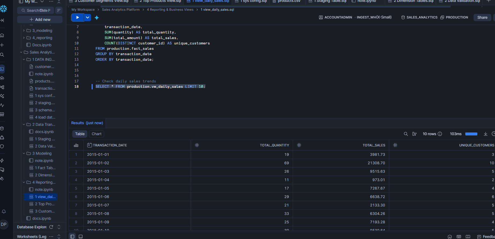
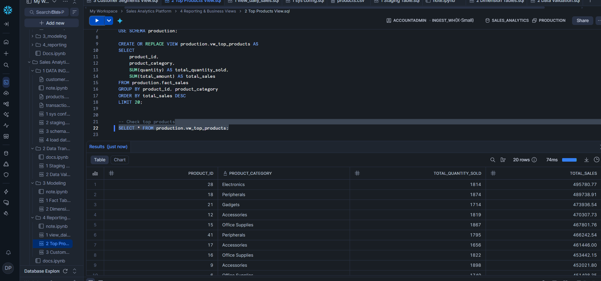
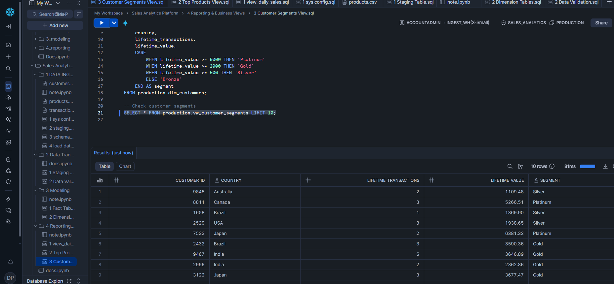

---

# **Sales Analytics Project – End-to-End Snowflake Data Warehouse**

## **Project Overview**

The **Sales Analytics Data Warehouse** is built on **Snowflake** to provide a robust, scalable, and BI-ready analytics solution.

**Goals:**

* Centralized storage of **customer, product, and transaction data**
* Clean, validated, and traceable datasets
* Optimized for **business reporting and analytics**
* Monitoring and optimization for **reliability, performance, and cost efficiency**

**Key Features:**

* **Layered architecture:** RAW → STAGING → PRODUCTION → REPORTING → MONITORING → OPTIMIZATION
* **Star schema** for analytics-ready tables
* Production-grade **monitoring and optimization**

---

## **Architecture Layers**

### **Layer 1 – RAW (Data Ingestion)**

**Purpose:** Ingest data **as-is** without transformations.

**Components:**

| Component           | Description                                            |
| ------------------- | ------------------------------------------------------ |
| Warehouse           | `ingest_wh` (auto suspend/resume for CSV loading)      |
| Database/Schema     | `sales_analytics.raw`                                  |
| Tables              | `customers`, `products`, `transactions`                |
| File Format & Stage | CSV format `csv_ff` + internal stage `sales_csv_stage` |

**Characteristics:**

* Preserves original data
* Adds load timestamp and source file info
* Immutable for traceability
* No transformations

---

### **Layer 2 – STAGING (Data Cleaning & Transformation)**

**Purpose:** Prepare data for analytics by type-casting, validation, and metric derivation.

**Tables & Transformations:**

| Table                  | Key Actions / Metrics                                                                                 |
| ---------------------- | ----------------------------------------------------------------------------------------------------- |
| `staging.customers`    | Type-cast IDs and dates                                                                               |
| `staging.products`     | Type-cast IDs, unit_price                                                                             |
| `staging.transactions` | Type-cast IDs, quantity, unit_price, transaction_date; derived `total_amount = quantity × unit_price` |

**Notes:**

* Load timestamp added for audit
* Basic validation: missing references, invalid IDs
* Ensures **downstream reliability**

---

### **Layer 3 – PRODUCTION (Fact & Dimension Modeling)**

**Purpose:** Build **analytics-ready tables** using a **star schema**.

| Table           | Type      | Description                                                                                             |
| --------------- | --------- | ------------------------------------------------------------------------------------------------------- |
| `fact_sales`    | Fact      | Grain: one row per customer × product × transaction_date; clustered by `(transaction_date, product_id)` |
| `dim_customers` | Dimension | Customer attributes + derived metrics (lifetime transactions, lifetime value, last purchase date)       |
| `dim_products`  | Dimension | Product attributes + derived metrics (avg_unit_price)                                                   |

**Key Points:**

* Optimized for BI queries and aggregations
* Star schema supports customer-level and product-level analysis
* Performance-focused clustering

---

### **Layer 4 – REPORTING (Business Views)**

**Purpose:** Provide ready-to-use views for business dashboards.

| View                   | Purpose                                  |
| ---------------------- | ---------------------------------------- |
| `vw_daily_sales`       | Daily revenue trends                     |
| `vw_top_products`      | Top-selling products                     |
| `vw_customer_segments` | Customer segmentation and lifetime value |

**Notes:**

* Pre-aggregated metrics for fast BI access
* Simplified, business-friendly columns
* Read-only to prevent accidental changes

**Sample Visuals:**

**Daily Sales Revenue**

<p align="center">
  
</p>

**Top Selling Products**

<p align="center">
  
</p>

**Customer Segmentation**

<p align="center">
  
</p>

---

### **Layer 5 – MONITORING & OBSERVABILITY**

**Purpose:** Track warehouse performance, query execution, data pipeline health, and costs.

| Monitoring Area      | Data Source                                 | Description                                     |
| -------------------- | ------------------------------------------- | ----------------------------------------------- |
| Warehouse Load       | `INFORMATION_SCHEMA.WAREHOUSE_LOAD_HISTORY` | Active queries, queued queries, blocked queries |
| Query Performance    | `ACCOUNT_USAGE.QUERY_HISTORY`               | Query runtime, bytes scanned, rows produced     |
| Long-Running Queries | `QUERY_HISTORY`                             | Queries exceeding threshold execution time      |
| Failed Queries       | `QUERY_HISTORY`                             | Pipeline failures and SQL errors                |
| Credit Usage         | `WAREHOUSE_METERING_HISTORY`                | Compute credit consumption                      |
| Expensive Queries    | `QUERY_HISTORY`                             | Large data scans                                |
| Pipeline Row Counts  | RAW/STAGING/PRODUCTION tables               | Ensure data completeness and correctness        |
| Daily Credit Trends  | `WAREHOUSE_METERING_HISTORY`                | Track credit usage over time                    |

**Implementation:**

* 8 views created in `monitoring` schema
* Dashboard-ready queries for BI and alerting

---

### **Layer 6 – OPTIMIZATION (Performance & Cost)**

**Purpose:** Ensure system efficiency, fast queries, and cost control.

| Technique                    | Description                                                       |
| ---------------------------- | ----------------------------------------------------------------- |
| Table Clustering             | `(transaction_date, product_id)` on fact table                    |
| Query Optimization           | Only select necessary columns, use filters                        |
| Query Profiling              | Use `QUERY_HISTORY` to analyze slow/expensive queries             |
| Warehouse Auto Scaling       | Multi-cluster scaling for concurrency                             |
| Auto Suspend & Resume        | Suspend idle warehouse to reduce costs                            |
| Result Caching               | Reuse query results to save compute and speed up repeated queries |
| Micro-Partition Pruning      | Filter queries scan only relevant partitions                      |
| Clustering Health Monitoring | `SYSTEM$CLUSTERING_INFORMATION` to check clustering efficiency    |

---

## **Data Flow Summary**

```
Source CSV Files
       │
       ▼
RAW Layer (Immutable, CSV load)
       │
       ▼
STAGING Layer (Clean, typed, metrics derived)
       │
       ▼
PRODUCTION Layer (Fact & Dimension tables, star schema)
       │
       ▼
REPORTING Layer (BI views: daily sales, top products, customer segments)
       │
       ▼
MONITORING Layer (Warehouse load, query performance, pipeline health)
       │
       ▼
OPTIMIZATION Layer (Clustering, query tuning, auto scaling, cost control)
```

| Step | Layer        | Action                                    |
| ---- | ------------ | ----------------------------------------- |
| 1    | RAW          | Load CSV files into raw tables            |
| 2    | STAGING      | Parse, type-cast, derive metrics          |
| 3    | PRODUCTION   | Build fact & dimension tables             |
| 4    | REPORTING    | Create KPI views and audit table          |
| 5    | MONITORING   | Track warehouse, queries, pipeline health |
| 6    | OPTIMIZATION | Performance tuning & cost control         |

---

## **Relationships**

* Customers (1) → Transactions (many)
* Products (1) → Transactions (many)
* Supports: customer-level revenue, product performance, drill-down analysis

---

## **Key Takeaways**

* **Layered architecture** ensures clean, traceable data
* RAW → preserves source data
* STAGING → typed, validated, and metrics derived
* PRODUCTION → analytics-ready star schema
* REPORTING → business-friendly views
* MONITORING → observability for pipeline, queries, and warehouse
* OPTIMIZATION → clustering, query tuning, cost efficiency
* Derived metrics: `total_amount`, lifetime value, avg unit_price

---

✅ **Conclusion**

This **End-to-End Snowflake Data Warehouse** demonstrates:

* Full enterprise-grade architecture: ingestion → cleaning → modeling → reporting → monitoring → optimization
* BI-ready tables, dashboards, and views
* Production best practices for **performance, reliability, and cost efficiency**

---
